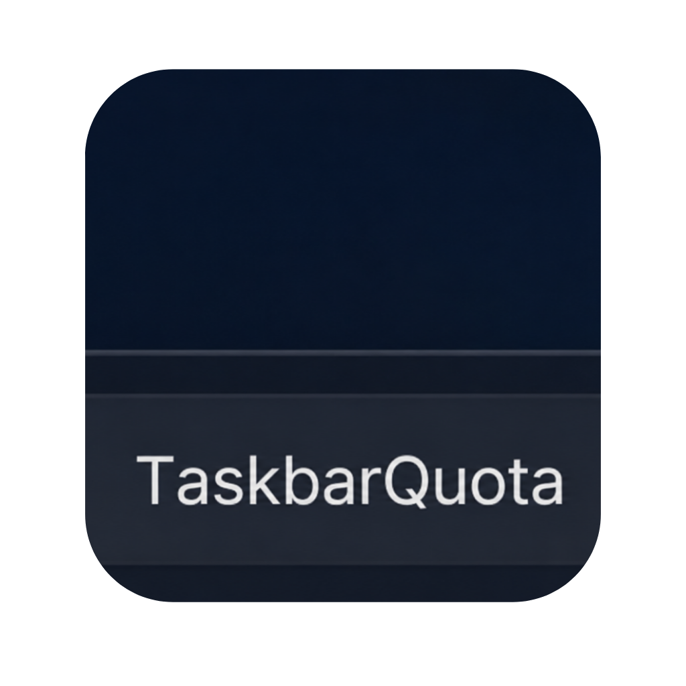

<p align="center"></p>

<h1 align="center">TaskbarQuota</h1>

<p align="center">
  A native <b>Windows</b> taskbar companion that <b>automatically detects which AI tool you are using</b> — the focused desktop app <i>or</i> the agent running in your terminal — and shows live usage for <em>that</em> provider only.<br/>
  Sessions, rate windows, cost or balance; compact widget beside the tray; full dashboard on demand; no cloud backend.
</p>

<p align="center">
  <a href="https://apps.microsoft.com/detail/9n3kl49vfpvn?hl=en-US&amp;gl=US&amp;mode=direct">
    
  </a>
<a href="https://github.com/zioder/TaskbarQuota/releases/latest">
  
</a>
</p>

<p align="center">
  <a href="https://www.buymeacoffee.com/zioder"></a>
</p>


https://github.com/user-attachments/assets/c339b79f-f3c6-4344-a6e6-bd6d60f75da2


---

TaskbarQuota is a **WinUI 3** desktop app that injects a small XAML island into the Windows taskbar (next to the notification area). You do **not** pick a provider from a list every time you switch tools — the app watches what you are actually doing on Windows and switches the widget, flyout, and active fetch to match.

On first launch after upgrading from the internal **WinCheck** codename, settings and `credentials.json` are copied from `%LOCALAPPDATA%\WinCheck` when the TaskbarQuota folder does not already contain them.

## Automatically follows your active tool

TaskbarQuota answers one question: **“What am I using right now, and how much quota is left?”** It distinguishes two cases:

| You are working in… | How TaskbarQuota decides |
| ------------------- | ------------------------ |
| **A desktop AI app** (Cursor, Antigravity, Codex, Claude, VS Code with Copilot, …) | The **foreground window** is matched to a provider. |
| **A terminal** (Windows Terminal, PowerShell, Warp, WezTerm, …) | The focused shell is detected, then running processes are scanned for CLI agents (`claude`, `codex`, `cursor-agent`, `opencode`, `gh copilot`, …). The **most recently started** matching agent wins. |

When you alt-tab from Cursor into a PowerShell session running Claude Code, the widget retargets to **Claude** within about half a second. When you leave all supported tools, the widget can fade until you return to one. If the foreground app is unrelated (browser, Slack, …), TaskbarQuota keeps showing the **last active** provider so the taskbar still has context.

**Examples**

- Cursor IDE focused → **Cursor** usage  
- Windows Terminal + `claude` in the command line → **Claude** usage  
- VS Code focused → **GitHub Copilot** usage  
- OpenCode model switch (Zen vs Go) → provider updates without restarting TaskbarQuota  
- Cline surface switch (Usage-Billing vs ClinePass) → provider updates without restarting TaskbarQuota  

After detection, usage is fetched from **local credentials** or **provider APIs** (see [Supported providers](#supported-providers)). Click the widget for a flyout; open the full window for every provider at once, reset times, and manual credential fixes.

## Features

### What's new in 1.0.18

- **Z.ai support** — TaskbarQuota now reads the Z.ai Coding Plan quota (5-hour prompt pool as **Session**, 7-day **Weekly**, plus a monthly **MCP** tool-call meter shown by default and hideable per row) from the ZCode config at `%USERPROFILE%\.zcode\v2\config.json`.
- **Kimi support** — detects the terminal-only `kimi` CLI and reads its 5-hour rate limit as **Session** and the 7-day coding quota as **Weekly**, via the Kimi Code OAuth credential (`%USERPROFILE%\.kimi-code\credentials\kimi-code.json`) or a manually entered `KIMI_CODE_API_KEY`.
- **ChatGPT desktop app detection** — OpenAI renamed the Codex desktop app to **ChatGPT**; the foreground `ChatGPT.exe` is now attributed to Codex usage. (#15)
- **Codex weekly label** — when OpenAI returns a single (weekly) rate window after temporarily dropping the 5-hour session limit, the widget now labels it **Weekly** instead of Session. (#18)
- **Taskbar widget positioning overhaul** — a gap solver keeps the widget clear of the weather/Widgets pill, the centered app icons, and the system tray; drag-in-progress is no longer stomped by background repositions, and the widget only settles where it fully fits. (#17)

### What's new in 1.0.17

- **Cline support** — TaskbarQuota now detects the `cline` CLI and shows either **Cline Usage-Billing** credit balance or **ClinePass** subscription windows.
- **Live Cline surface switching** — watches `%USERPROFILE%\.cline\data\settings\providers.json` so switching between Cline Usage-Billing and ClinePass updates the active card without restarting TaskbarQuota.
- **Cline account auth refresh** — reads local Cline WorkOS tokens and refreshes expired access tokens in memory without rewriting Cline's settings file.

### What's new in 1.0.16

- **Claude Fable weekly meter** — TaskbarQuota now reads Anthropic's model-scoped `limits[]` entries and shows Fable usage in the widget by default.
- **Codex credit balances** — Codex Business and Enterprise-style plans can show raw credits without inventing a fixed cap, plus reset-credit details when available.
- **Cleaner quota rows** — Claude uncapped extra usage no longer renders a fake `Session 0%` bar, while legacy Sonnet/Opus windows keep their own labels.
- **Taskbar widget reliability** — the native widget host hides fully when no eligible provider is active and better avoids the tray/widgets area on complex taskbars.

### What's new in 1.0.15

- **Browser tab detection** — TaskbarQuota reads the active browser tab to attribute usage to the provider you're actually using (ChatGPT, Claude, Gemini, and more), instead of folding web chats into coding-client providers.
- **Login with Claude** — a cookie-free one-click sign-in for Claude usage that survives Chrome's App-Bound Encryption, with an automatic fallback to `claude.ai` browser cookies when no CLI is present.
- **Detection source in the UI** — the dashboard and widget now show how each provider was detected (browser, desktop app, terminal, or host app), plus a dismissible onboarding panel.
- **Multi-monitor widget confinement** — on setups where one taskbar spans displays, the widget stays on the monitor hosting the notification area instead of straddling the seam.

### What's new in 1.0.14

- **T3 Code detection** — TaskbarQuota now recognises upstream T3 Code and attributes the active thread's usage to its selected provider, with a dedicated T3 Code badge in the taskbar widget.
- **More stable taskbar placement** — the widget's resting position stays steady as taskbar app buttons change, and provider-widget fallback respects the enabled provider settings.

### What's new in 1.0.13

#### New features

- **[Synara](https://github.com/Emanuele-web04/synara) active-provider detection** — when Synara is the focused app, TaskbarQuota reads the active thread/composer selection and attributes usage to its inner provider (Codex, Claude, Cursor, Grok, OpenCode, or OpenCode Go). The widget adds a Synara host badge with the selected model and thread context.
- **Codex reset-credit tracking** — the Codex widget now shows the number of available reset credits and when the oldest available credit expires. The dashboard includes a **Reset credits** section with each available credit's grant and expiry details.
- **Expiry notifications** — TaskbarQuota notifies you when the oldest available Codex reset credit is within five days of expiring. Alerts are throttled per expiry so the same credit does not repeatedly notify you.

#### Improvements and fixes

- **Better flyout and dashboard sizing** — layouts adapt their width and height to the current provider content for a cleaner fit.
- **Smoother widget updates** — provider switches and dashboard selection changes render more responsively with less flicker.
- **More resilient Synara state reads** — incremental LevelDB reads are block-aligned, legacy Synara process names are recognised, and background state changes are handled without delaying active-provider updates.
- **Non-blocking reset-credit lookup** — the optional Codex reset-credit request has its own short timeout, so it cannot hold up the primary usage refresh.

### Taskbar widget

- **In-taskbar compact UI** — usage bars and/or percentages injected beside the system tray (reparents a layered WinUI island into `Shell_TrayWnd`).
- **All taskbars** — creates a widget on the primary taskbar and every Windows secondary taskbar, with a separately saved drag position for each display.
- **Follows taskbar layout** — recenters when the taskbar moves, centers, or when Widgets / tray geometry changes.
- **Draggable placement** — drag to reposition; offset is saved under `%LOCALAPPDATA%\TaskbarQuota\`.
- **Click for flyout** — quick provider strip and settings shortcut above the widget.
- **Fades when idle** — widget can hide when no supported AI tool process is detected; returns when you focus a supported app or terminal session.

### Active-tool detection (desktop app **or** terminal agent)

This is the core behavior — everything else (widget, flyout, fetch cache) hangs off it.

- **Desktop apps** — process name of the focused window: Cursor, Antigravity, Codex, Claude, Devin, VS Code / Insiders (Copilot), and similar.
- **Terminal agents** — if a known terminal is focused, WMI/process scan looks at command lines for Claude Code, Codex, `cursor-agent`, OpenCode, `cline`, `gh copilot`, Grok, Devin, Antigravity CLI, and related launchers (Windows Terminal, PowerShell, `pwsh`, WezTerm, Alacritty, …).
- **Fast switching** — coordinator polls about every **500 ms**, so changing app or shell updates the active provider quickly; usage API calls are cached for **60 seconds** so providers are not spammed.
- **OpenCode model switch** — watches OpenCode model state to move between OpenCode Zen and OpenCode Go without restarting the app.
- **Cline surface switch** — watches Cline provider state to move between Cline Usage-Billing and ClinePass without restarting the app.
- **Sticky last provider** — unrelated foreground apps do not clear the widget; last detected tool stays until you focus a supported app or terminal again.
- **Idle hide** — optional fade when no supported AI process is running; comes back when you focus a supported app or terminal session.

### Supported providers

| Provider | What you see | How usage is fetched |
| -------- | ------------ | -------------------- |
| **Codex** | Session and rate windows | OAuth token from `%USERPROFILE%\.codex\auth.json` (or `%CODEX_HOME%`) → ChatGPT usage API |
| **GitHub Copilot** | Quota snapshots | `GITHUB_TOKEN` / `GH_TOKEN`, saved credentials, or `gh auth token` → GitHub Copilot internal API |
| **Claude** | 5-hour, weekly, and model windows | `%USERPROFILE%\.claude\.credentials.json` or env override → Anthropic OAuth usage API |
| **Antigravity** | Local status | Running `language_server` process → CSRF token and port → `127.0.0.1` status API |
| **Cursor** | Usage summary | Cursor `state.vscdb`, browser cookies, or manual cookie header → Cursor / cursor.com APIs |
| **OpenCode Zen** | Billing usage and balance | Browser cookies for `opencode.ai` or manual cookie → workspace billing pages |
| **OpenCode Go** | Rolling, weekly, and monthly windows | Same cookie path as Zen → OpenCode server workspace APIs |
| **Cline Usage-Billing** | Pay-as-you-go credit balance | `%USERPROFILE%\.cline\data\settings\providers.json` WorkOS auth → Cline account API |
| **ClinePass** | 5-hour, weekly, and monthly windows | Same Cline settings file → Cline subscription usage-limits API |
| **Z.ai** | Session (5-hour), weekly, and monthly MCP windows | API key from `%USERPROFILE%\.zcode\v2\config.json` (or `Z_AI_API_KEY`) → Z.ai monitor quota API |
| **Kimi** | Session (5-hour rate limit) and weekly coding quota | Kimi Code OAuth from `%USERPROFILE%\.kimi-code\credentials\kimi-code.json` (or `KIMI_CODE_API_KEY`) → Kimi Code usage API |
| **Grok** | Credits meter and monthly window | Grok CLI token from `%USERPROFILE%\.grok\auth.json` (or `%GROK_HOME%`) → xAI CLI proxy billing API |
| **Devin** | Weekly and daily quota, extra usage balance | Devin CLI `credentials.toml` or Devin desktop app `state.vscdb` → Codeium SeatManagement usage API |

Each provider card on the dashboard shows plan name, reset times, rate windows, and optional cost or balance when the API returns it. Use **Fix** on a card when auto-detection fails to paste tokens or cookie headers into `%LOCALAPPDATA%\TaskbarQuota\credentials.json`.

### Dashboard & shell

- **Full dashboard** — all registered providers at once with refresh, error states, and detail cards.
- **System tray** — Open, show widget, and Exit.
- **Run at startup** — optional Windows startup registration; can launch widget-only.
- **Settings** — light / dark / system theme, widget layout (bars, percentages, or both), consumed vs remaining percentage display.

### Privacy

- **Local-only** — no TaskbarQuota backend; usage calls go directly from your PC to each provider (or localhost for Antigravity).
- **No telemetry** — diagnostics log to `%TEMP%\taskbarquota.log` only.
- **Cookie extraction is in-memory** — browser cookies are read to build a request header for the active fetch; they are not intentionally persisted (manual credentials in `credentials.json` are plain JSON today — keep that file on your PC only).

## How it works

```text
ActiveAppDetector
  ├─ foreground GUI app  → ProviderId
  └─ focused terminal      → scan CLI processes → ProviderId
        ↓
UsageCoordinator (500 ms tick, picks active provider)
        ↓
UsageService (provider registry + 60 s success cache, shorter TTL on errors / 429)
        ↓
IUsageProvider implementations (HTTP / local API / SQLite / DPAPI)
        ↓
TaskBarManager → WidgetSummary (taskbar) + Dashboard + Flyout
```

1. **Detection** — `ActiveAppDetector` maps the foreground process (or CLI child of a known terminal) to a `ProviderId`.
2. **Fetch** — the matching `IUsageProvider` loads tokens from CLI config files, environment variables, TaskbarQuota credentials, Cursor's local database, or `CookieExtractor` (Chromium / Firefox profiles, copied to `%TEMP%` for locked DBs).
3. **Normalize** — results become a `UsageSnapshot` with `RateWindow` rows and optional `CostSnapshot`.
4. **Display** — `UsageCoordinator` raises `StateChanged`; the taskbar widget and dashboard apply the snapshot. Fetches are cached so providers are not hammered on every tick.

### Architecture at a glance

| Path | Role |
| ---- | ---- |
| `src/TaskbarQuota.App/ActiveApp/` | Foreground and CLI provider detection |
| `src/TaskbarQuota.App/Browser/` | Browser cookie discovery and Chromium decryption |
| `src/TaskbarQuota.App/Taskbar/` | Widget host, tray icon, taskbar layout watcher |
| `src/TaskbarQuota.App/Usage/Providers/` | Per-provider fetch logic |
| `src/TaskbarQuota.App/Usage/UsageService.cs` | Registry and TTL cache |
| `src/TaskbarQuota.App/UsageCoordinator.cs` | Timer-driven detect → fetch → UI update |
| `src/TaskbarQuota.App/Views/` | Dashboard and settings |
| `tests/TaskbarQuota.Tests/` | Unit tests |

## Local development

### Requirements

- **Windows 10** 19041 or newer (Windows 11 recommended for taskbar behavior).
- [.NET SDK](https://dotnet.microsoft.com/download) **10.0.x** (project targets `net10.0-windows10.0.19041.0`).
- [Windows App SDK / WinUI 3](https://learn.microsoft.com/windows/apps/winui/winui3/) workload.

You need working sign-in for the providers you test (local OAuth files, GitHub CLI, Cursor install, etc.). No separate server install.

### Build & run

From the repository root:

```powershell
# Build (Debug, x64)
dotnet build src/TaskbarQuota.App/TaskbarQuota.App.csproj -c Debug -p:Platform=x64

# Run
dotnet run --project src/TaskbarQuota.App/TaskbarQuota.App.csproj

# Tests
dotnet test tests/TaskbarQuota.Tests/TaskbarQuota.Tests.csproj
```

Diagnostic log:

```text
%TEMP%\taskbarquota.log
```

### Manual credentials (optional)

```text
%LOCALAPPDATA%\TaskbarQuota\credentials.json
```

```json
{
  "cursor": {
    "cookieHeader": "name=value; other=value"
  },
  "copilot": {
    "apiKey": "github_pat_or_token"
  },
  "opencode": {
    "cookieHeader": "name=value; other=value"
  }
}
```

## Release & distribution

Install the signed Microsoft Store build:

<p>
  <a href="https://apps.microsoft.com/detail/9n3kl49vfpvn?hl=en-US&amp;gl=US&amp;mode=direct">
    
  </a>
</p>

Download the latest installer from [GitHub Releases](https://github.com/zioder/TaskbarQuota/releases).

| Download | CPU |
| -------- | --- |
| `TaskbarQuotaSetup-<version>-x64-unsigned.exe` | Intel / AMD (most PCs) |
| `TaskbarQuotaSetup-<version>-arm64-unsigned.exe` | Windows on ARM |

Run the matching `.exe`, then launch TaskbarQuota from the Start menu. Windows may show **SmartScreen** for unsigned builds — **More info** → **Run anyway**.

Microsoft Store builds use the signed package identity `ZiedKallel.TaskbarQuota_q2e4dm2bjnsne`. When a Store-installed build sees an update, TaskbarQuota opens the Microsoft Store product page instead of downloading the unsigned GitHub installer.

## Project structure

```text
TaskbarQuota/
├── .github/workflows/release.yml   # Tag builds → GitHub Release installers
├── installer/TaskbarQuota.iss      # Inno Setup (x64 + arm64)
├── src/
│   ├── taskbarquota.png            # README / branding icon
│   └── TaskbarQuota.App/           # WinUI 3 app
├── tests/TaskbarQuota.Tests/       # Unit tests
├── TaskbarQuota.slnx
├── LICENSE
└── README.md
```

## License

TaskbarQuota is released under the [MIT License](LICENSE).

## Support

If TaskbarQuota is useful to you, consider supporting development:

<a href="https://www.buymeacoffee.com/zioder"></a>
