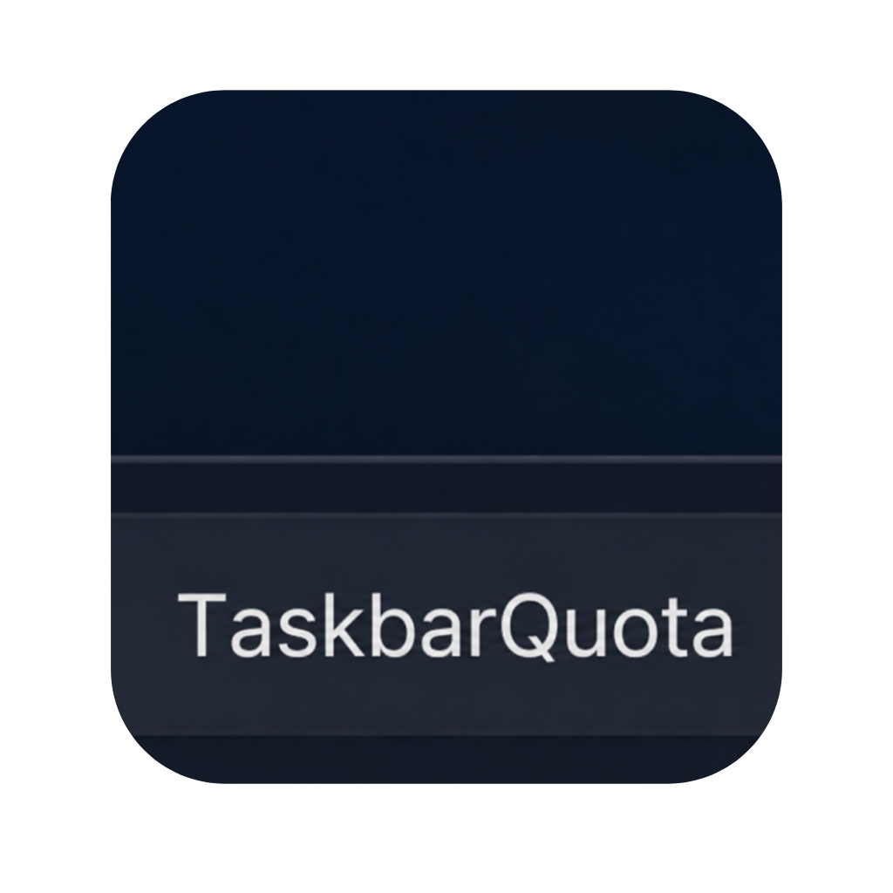

<p align="center">
  
</p>

<h1 align="center">TaskbarQuota</h1>

<p align="center">
  Live AI usage, cost, and agent activity in the Windows taskbar.
</p>

<p align="center">
  <a href="https://apps.microsoft.com/detail/9n3kl49vfpvn?hl=en-US&amp;gl=US&amp;mode=direct">
    
  </a>
  <a href="https://github.com/zioder/TaskbarQuota/releases/latest">
    
  </a>
</p>

https://github.com/user-attachments/assets/c339b79f-f3c6-4344-a6e6-bd6d60f75da2

TaskbarQuota is a native Windows app for people who use several AI coding tools. It detects the provider in your focused app or terminal, then keeps the relevant quota visible beside the system tray. Open the dashboard for usage history, model-level costs, and a live view of local coding agents.

Everything runs on your PC. TaskbarQuota has no account system, cloud backend, or telemetry.

## Install

TaskbarQuota supports Windows 10 version 2004 (build 19041) and newer. Windows 11 is recommended.

- Install the signed build from the [Microsoft Store](https://apps.microsoft.com/detail/9n3kl49vfpvn?hl=en-US&gl=US&mode=direct).
- Or download the latest `x64` or `arm64` installer from [GitHub Releases](https://github.com/zioder/TaskbarQuota/releases/latest).

GitHub installers are currently unsigned, so Windows SmartScreen may ask for confirmation. Choose **More info**, then **Run anyway**.

## What it does

### Usage in the taskbar

TaskbarQuota places a compact, draggable widget next to the notification area. It shows quota windows, percentages, reset times, credits, or balances depending on the provider.

The widget can:

- follow the active tool automatically;
- keep up to three providers pinned;
- appear on each taskbar in a multi-monitor setup;
- run as a floating always-on-top window instead;
- show bars, percentages, or both, as used or remaining.

Click the widget for a quick flyout. Open the main window to see every provider and change settings.

### Automatic tool detection

When an AI desktop app is focused, TaskbarQuota matches its process to a provider. When a terminal is focused, it looks for a running CLI agent such as Codex, Claude Code, OpenCode, Cline, Kimi, Grok, or GitHub Copilot.

Switching between an editor and a terminal updates the widget automatically. TaskbarQuota also follows provider changes inside supported hosts such as OpenCode, Cline, Synara, and T3 Code.

### Agent activity

A separate activity widget shows what local coding agents are doing. Sessions can appear as working, waiting, idle, completed, or failed, and the flyout lets you jump between active sessions.

Activity is read from local processes and session data for Codex, Claude, OpenCode, Cline, Kimi, Grok, Antigravity, GitHub Copilot, and ZCode. Completed items expire automatically. You can hide the activity widget or disable monitoring completely.

### Cost and usage history

The Cost page combines locally available usage across providers. It includes:

- spend and token totals for today, the last 7 days, and the last 30 days;
- daily history and provider comparisons;
- per-model token and cost breakdowns;
- reported costs when available, with estimates from bundled pricing data otherwise;
- shareable summary cards.

Cost coverage depends on the data stored by each provider. Codex, Claude, Grok, OpenCode, Cline, and Z.ai are read from local logs or databases. Cursor is estimated from composer context meters in `state.vscdb` (current Cursor builds store zeros in per-bubble token counts). Antigravity is estimated from visible transcript text. TaskbarQuota labels estimated values and does not invent a cost when it lacks enough information.

### Dashboard and notifications

The dashboard shows all enabled providers, their current plan, quota windows, reset times, balances, and recent history. TaskbarQuota can start with Windows and notify you when quota thresholds are crossed or Codex reset credits are close to expiring.

Quota replenishment notifications are enabled by default and remain independent from the optional Warning and Critical threshold alerts. They notify when a live percentage-based window gains at least **10 percentage points** of available quota, including partial replenishments and readings that reach 99% after a reset has already been used. Primary, Secondary, Model, Monthly, and named extra windows are tracked separately, and multiple replenished windows from the same provider are grouped into one notification.

The first live reading after launch or after re-enabling the option establishes a baseline without notifying. A separate, disabled-by-default **Changes since last session** option can compare the first live reading after startup with TaskbarQuota's last confirmed live observation. This can report a replenishment that happened while the app or PC was off, but only after TaskbarQuota starts and refreshes that provider.

Cross-session comparison requires the same provider and account identity, stable window metadata, and an observation no more than 35 days old. Missing or changing identity, stale state, cached or restored snapshots, failures, and changed window definitions establish a new baseline silently. The Consumed/Remaining display preference does not affect detection.

Notifications use the coordinator's existing provider refreshes. They work with the dashboard closed and the widget hidden while TaskbarQuota is running and receiving live observations for that provider. The feature adds no polling, timer, network request, telemetry, or remote notification service.

## Supported providers

| Provider | Usage shown | Automatic credential source |
| --- | --- | --- |
| Codex | Session and weekly windows, credits | Codex OAuth session |
| GitHub Copilot | Chat and completion quotas | Environment, saved token, or GitHub CLI |
| Claude | Session, weekly, and model windows | Claude OAuth session |
| Antigravity | Local quota status | Running language server |
| Cursor | Plan usage and limits | Local app data or browser session |
| OpenCode Zen | Spend and balance | Browser session or manual cookie |
| OpenCode Go | Rolling, weekly, and monthly windows | Browser session or local data |
| Cline Usage-Billing | Credit balance | Local Cline account session |
| ClinePass | Session, weekly, and monthly windows | Local Cline account session |
| Z.ai | Session, weekly, and MCP windows | ZCode config or API key |
| Kimi | Session and weekly quota | Kimi Code OAuth or API key |
| Grok | Credits and monthly window | Grok CLI session |
| Devin | Daily and weekly quota, extra usage | Devin CLI or desktop session |

TaskbarQuota reuses credentials already stored by supported tools when possible. If automatic detection fails, use **Fix** on the provider card to enter the required token or cookie manually.

## Privacy

- Usage requests go directly from your PC to the provider.
- Agent activity and prompt-derived session titles stay on your PC.
- TaskbarQuota does not collect telemetry or send data to a TaskbarQuota server.
- Diagnostics are written only to `%TEMP%\taskbarquota.log`.
- Automatic browser cookies are read in memory. Credentials entered manually are stored in plain JSON at `%LOCALAPPDATA%\TaskbarQuota\credentials.json`, so keep that file private.
- Optional cross-session replenishment state is stored locally in `quota-replenishment-state.json`. It contains percentage-window metadata, timestamps, and a one-way identity hash, never the plaintext account identifier. Disabling either replenishment notifications or the cross-session option clears it.

Disable **Monitoring** in the activity flyout to stop local process and session inspection and clear retained activity from memory.

## OpenCode sign-in note

Modern Chromium browsers protect cookies with App-Bound Encryption, so TaskbarQuota may not be able to read an OpenCode session from recent versions of Chrome, Edge, or Brave. Firefox-based browsers are supported, or you can paste a copied OpenCode request into the provider's **Fix** dialog. TaskbarQuota accepts either a full cURL command or its `Cookie` header.

Cookie headers are session credentials. Do not paste them into issues or public chat.

## Build from source

Requirements:

- Windows 10 build 19041 or newer
- [.NET SDK 10](https://dotnet.microsoft.com/download)
- Windows App SDK and WinUI 3 tooling

```powershell
# Build
dotnet build src/TaskbarQuota.App/TaskbarQuota.App.csproj -c Debug -p:Platform=x64

# Run
dotnet run --project src/TaskbarQuota.App/TaskbarQuota.App.csproj

# Test
dotnet test tests/TaskbarQuota.Tests/TaskbarQuota.Tests.csproj
```

The app is a self-contained WinUI 3 build. It does not require a separate backend.

## License

TaskbarQuota is available under the [MIT License](LICENSE).

## Support

If you find TaskbarQuota useful, you can [support its development](https://www.buymeacoffee.com/zioder).
